# formatscout

[](https://www.python.org/downloads/)
[]()
[](LICENSE)
[](https://pypi.org/project/formatscout/)
[](https://github.com/rymorrisj/formatscout/actions)
[]()


Multi-tier format-identification for disk images and directory trees. Pure Python 3.11+ stdlib. Zero third-party runtime dependencies.

Given a path, `detect()` returns a `ScanResult`: `title`, `platform`, `era`, `confidence` (0.0-1.0), a `reason`, optional `requires_install`/`requires_extraction` flags, and `warnings`. It never raises. A garbage or unreadable path returns `confidence=0.0` with an explanatory reason instead of an exception.

Originally built for [Peach 1UP](https://github.com/rymorrisj/peach_1up), an emulator orchestration platform for retro media preservation. Extracted into a standalone package to help others do the same.

## Install

```bash
pip install formatscout
```

Or from source, for contributors:

```bash
git clone https://github.com/rymorrisj/formatscout.git
cd formatscout
uv pip install -e .
uv pip install pytest  # only needed to run the test suite
```

Or with plain pip:

```bash
pip install -e .
pip install pytest
```

Requires Python 3.11+ (`magic_detect.py` reads `magic_signatures.toml` via stdlib `tomllib`, added in 3.11).

## Detection pipeline

Runs in tier order, stops at the first confident match.

| Tier | Resolution Strategy | Description | Confidence Range |
|---|---|---|---|
| 1 | Hash Lookup | Full-file SHA-1 (MD5/CRC32 fallback) matched against the bundled preservation index. CHD containers match on the embedded `rawsha1` header field instead of raw file bytes. | 1.0 |
| 2 | Magic Bytes | Header signature matching at fixed byte offsets. Covers PS1, PS2, N64, NES, Dreamcast. | 0.9 |
| 3 | Structural Parsing | ISO 9660 PVD sector inspection, CHD v5 metadata walking, PE executable subsystem/OS parsing. | 0.65 – 0.9 |
| 4 | Directory Heuristics | AUTORUN.INF targets, root-level system markers (PS3_DISC.SFB, I386, SYSTEM.CNF, WIN98/95), depth-2 executable scans. | 0.4 – 0.9 |
| 5 | Extension & Size | File extension alone, or extension plus size for ambiguous cases (e.g. 4 GiB optical boundary). | 0.2 – 0.7 |

Diagram reflects the actual code path in `detector.py`, `iso_detect.py`, and `directory_detect.py`. If it disagrees with the table above, trust the diagram.

```mermaid
flowchart TD
    Start(["detect(path, dir_cache)"]) --> Exists{"path.exists()?"}
    Exists -- "no" --> RNone["ScanResult(confidence=0.0,<br/>reason='path does not exist')"]

    Exists -- "yes" --> Hash["Tier 1: hash_lookup.lookup()<br/>sha1 (or CHD embedded rawsha1) -&gt; md5 -&gt; crc32<br/>against hashing/hash_index.json"]
    Hash -- "era resolved (confidence 1.0 / 0.85 / 0.75)" --> Stamp
    Hash -- "no match / index missing" --> Kind{"file or directory?"}

    Kind -- neither --> RBad["ScanResult(confidence=0.0,<br/>reason='not a file or directory')"]
    Kind -- file --> FileDispatch["_detect_file(): dispatch on suffix"]
    Kind -- directory --> DirDispatch["detect_directory()"]

    FileDispatch --> ExtOnly[".nds / .xiso / .xex / .z64 family<br/>.sfc family / .nes / .pkg<br/>Tier 5: extension only, confidence 0.0-0.7"]
    FileDispatch --> GdCdi[".gdi / .cdi<br/>Tier 2 magic bytes: match -&gt; 0.9<br/>no match -&gt; Tier 5 era=dreamcast, 0.5"]
    FileDispatch --> IsoBranch[".iso -&gt; detect_iso()"]
    FileDispatch --> BinBranch[".bin -&gt; Tier 2 magic (0.9) -&gt; Tier 3 PVD (0.7-0.9)<br/>-&gt; bin_validator.resolve_bin_cue() (0.2-0.85)"]
    FileDispatch --> CueBranch[".cue -&gt; detect_cue(): find sibling .bin<br/>(none found -&gt; 0.0 + warning); found -&gt; same<br/>magic -&gt; PVD -&gt; resolve_bin_cue() chain as .bin"]
    FileDispatch --> ChdBranch[".chd -&gt; chd_validator.detect_chd_platform(): CHD v5 metadata chain<br/>CHGD tag -&gt; dreamcast 0.85; CHTR/CHT2 -&gt; ps1/ps2 by<br/>logical size, 0.3 heuristic; no tag -&gt; 0.0"]
    FileDispatch --> ImgBranch[".img -&gt; Tier 5 size fallback:<br/>era=dos 0.35 if &lt;800MB, else 0.0"]
    FileDispatch --> ExeBranch[".exe -&gt; exe_detect.detect_exe(): Tier 3 PE header<br/>MajorOSVersion/Subsystem -&gt; dos 0.65 / win98 0.75 /<br/>winxp 0.75; else 0.0"]
    FileDispatch --> NoSig["no suffix match -&gt; confidence=0.0"]

    IsoBranch --> IsoMagic["Tier 2 magic (applies_to='iso';<br/>no signature targets .iso today -&gt; always falls through)"]
    IsoMagic -- match --> IsoR1["confidence=0.9"]
    IsoMagic -- "no match" --> IsoPvd["Tier 3: detect_from_pvd()<br/>ISO 9660 PVD @ sector 16"]
    IsoPvd -- "PS3_DISC.SFB in root dir" --> IsoR2["era=ps3, 0.9"]
    IsoPvd -- ".XBE in root dir" --> IsoR3["era=xbox, 0.8"]
    IsoPvd -- "volume label / publisher keyword" --> IsoR4["era=winxp/win98/win95/dos/ps1/ps2, 0.7-0.75"]
    IsoPvd -- "no PVD signal" --> XboxImg["xbox_image.detect_xbox_image_type()<br/>(internal module, byte-offset check only)"]
    XboxImg -- "'xiso' (XDVDFS magic @ 0x10000)" --> IsoR5["era=xbox, 0.9"]
    XboxImg -- "'dvd_rip' (ISO9660 magic, size &gt; 4GB)" --> IsoR6["era=xbox, 0.9<br/>requires_extraction=True"]
    XboxImg -- "'iso9660' (container confirmed, no platform)" --> IsoFb
    XboxImg -- "'unknown'" --> IsoFb["Tier 5: _iso_size_fallback()<br/>by size vs 4 GiB / 800MB -&gt; 0.0-0.2<br/>era stays None; an iso9660 confirmation keeps<br/>confidence at 0.2 instead of 'no signal found'"]

    DirDispatch --> Autorun["Tier 4a: _detect_from_autorun()<br/>AUTORUN.INF OPEN=/RUN= -&gt; pointed .exe's PE header"]
    Autorun -- "era resolved" --> AutoR["era=dos/win98/winxp, 0.65-0.75"]
    Autorun -- "no signal" --> DirHeur["Tier 4b: _detect_from_directory()"]
    DirHeur -- "root marker files (PS3_DISC.SFB, XPSP/I386, WIN98/95,<br/>SYSTEM.CNF, INSTALL.*)" --> DirR3["era resolved by marker, 0.4-0.9<br/>(PS3_DISC.SFB checked first -&gt; ps3 0.9;<br/>SYSTEM.CNF via magic_detect.resolve_ps_generation_from_file)"]
    DirHeur -- "depth-2 scan (DOS tools, .WAD,<br/>split archives, .BAT, DOS-only exts)" --> DirR4["era=dos, 0.5-0.6"]
    DirHeur -- "nothing matched" --> DirR5["confidence=0.0"]

    ExtOnly & GdCdi & IsoR1 & IsoR2 & IsoR3 & IsoR4 & IsoR5 & IsoR6 & IsoFb & BinBranch & CueBranch & ChdBranch & ImgBranch & ExeBranch & NoSig & AutoR & DirR3 & DirR4 & DirR5 --> Stamp

    Stamp["_compute_requires_install(path, result.era)<br/>sets ScanResult.requires_install"] --> Final(["ScanResult returned to caller<br/>(detect() wraps all of this in try/except,<br/>any unexpected error -&gt; confidence=0.0)"])
```



PE parsing (`.exe` files and `AUTORUN.INF` targets) is handled by `exe_detect.detect_exe()` and `directory_detect._detect_from_pe()`, which both delegate the header classification (MZ/PE checks, `Subsystem` gate, `MajorOperatingSystemVersion` split) to a shared `exe_detect._classify_pe_header()` helper; only the reason text they build from it differs. `test_directory_detect.py` pins that the two stay in agreement.

`_compute_requires_install()` in `detector.py` runs after era detection and flags DOS-era installer media. That includes raw `.iso`/`.cue` files, small `.img` files, and directories whose only root-level executables are on the blocklist in `utils/blocklist.py`.

## Usage

```python
from pathlib import Path
from formatscout import detect, verify, classify, hash_file

scan = detect(Path("game.iso"))
if scan.era is not None:
    ...  # scan.title, scan.platform, scan.confidence, scan.reason
    ...  # scan.requires_install, scan.requires_extraction

result = verify(Path("game.iso"), expected_sha1="...")
result.status  # "matched" | "mismatched" | "not_in_index"

result = classify(Path("game.iso"), title="Halo", era="xbox")
result.status  # "verified" | "caution" | "mismatch" | "not_in_index" | "unchecked"

hashes = hash_file(Path("game.iso"))
hashes.sha1, hashes.md5, hashes.crc32
```

Check `scan.era` for `None` to decide whether `detect()` succeeded. `scan.warnings` can be populated even on a successful low-confidence match.

### Public API

Ten names are exported from `__init__.py`. Everything else is internal.

| Name | Signature | Notes |
|---|---|---|
| `detect` | `(path, dir_cache=None) -> ScanResult` | Main entry point |
| `verify` | `(path, expected_sha1) -> VerifyResult` | Hash-only re-check against the index |
| `classify` | `(path, title, era, threshold=0.80) -> ClassifyResult` | Five-state verification, no prior hash needed |
| `hash_file` | `(path) -> HashFileResult` | sha1/md5/crc32 in one read |
| `extract_embedded_sha1` | `(path) -> str \| None` | CHD v5 embedded `rawsha1`, no hunk decompression |
| `ScanResult`, `VerifyResult`, `ClassifyResult`, `HashFileResult` | N/A | Result dataclasses; see `result.py` docstrings |
| `Era` | `Literal["ps1", "ps2", ...]` | Type hint only, `ScanResult.era`'s value space; runtime values are still plain `str \| None` |

## Supported platforms / eras

Detection logic (tiers 2-5) covers **PS1, PS2, PS3, Xbox, Xbox 360, Dreamcast, N64, NES, SNES, DOS, Windows 95, Windows 98, and Windows XP**.

The bundled hash index (`hash_index.json`) has confirmed entries for more platforms than earlier notes suggested. At minimum: PlayStation, PlayStation 2, PlayStation 3, Xbox, Dreamcast, SNES, and NES. Example entry:

<details>
<summary><b>Click to view example of an <code>hash_index.json</code> entries</b></summary>

```json
"c8a6337da7fd0b4c75f6375a79e4eea9f4da08fd": {
    "title": "Mortal Kombat Gold (Europe)",
    "platform": "Sega - Dreamcast",
    "era": "dreamcast"
}
```
</details>

**IBM PC compatible** DATs parse and index cleanly but have no `_ERA_MARKERS` mapping. Redump's PC category covers DOS/Win95/98/XP under one platform-name string, so mapping to a specific era needs a per-title resolution strategy that doesn't exist yet. These entries index with `era: null` by design, not as an error:

<details>
<summary><b>Click to view example of an <code>IBM PC compatible</code> entry</b></summary>
    
```json
"35e032ca9a5efa0cdc9b98df342351fc4b6e3714": {
    "title": "Nintendo 64 Roku Yon Total Pack for OS2.0J (Japan) (Nintendo 64 Integrated Online Manual)",
    "platform": "IBM - PC compatible",
    "era": null,
    "source": "IBM - PC compatible - Datfile (58837) (2026-06-15 06-43-57)",
    "md5": "a344a91cb48ec6e647b2c2b66d464c16",
    "crc32": "d09bab04"
}
```
</details>

**Xbox 360** has an `_ERA_MARKERS` mapping and hash-index entries, but no structural/directory detection path exists for it yet in tiers 2-5. It's reachable only via a Tier 1 hash hit.

## Adding a new DAT

```bash
python -m formatscout.hashing.build_index \
    --dats <directory-of-dat-files> [--output <path>] [--rebuild]
```

Manual process, no ingestion automation. Sourced from [Redump](http://redump.org/), [No-Intro](https://datomatic.no-intro.org/), and [TOSEC](https://www.tosecdev.org/). Only records with a `sha1` value get indexed. MD5/CRC32-only entries parse without error but contribute zero rows. The run logs a skipped-record count, so this isn't silent.

DAT files are third-party, untrusted input. `dat_parser.parse_dat()` rejects any DAT that declares XML entities in its DOCTYPE internal subset, guarding against the entity-expansion vector in `ElementTree`. Real Logiqx/Redump/No-Intro external DOCTYPEs are unaffected. The index write is atomic, a temp file plus `os.replace()`, so an interrupted run leaves the previous index intact.

## Known limitations

- Xbox OG ISOs with no `.xbe` in the root directory fall through to `xbox_image.py`'s byte-offset check. The magic-byte tier doesn't apply here since no `.iso` signature exists. This is rare in practice. Standard rips include `DEFAULT.XBE`.
- `.bin`/`.cue` pairs missing their `.cue` sibling return low confidence with a warning.
- Every entry point takes a local, seekable `Path`. No stream or object-storage handle support.
- Only `detect()` is exception-safe end to end. `classify()` catches `OSError` → `status="unchecked"`. `verify()` and `hash_file()` let read errors propagate.
- Size thresholds use different units by design. The Xbox DVD-rip/ISO-fallback boundary is binary 4 GiB. The PS1/PS2 boundary in `detect_from_pvd()` is decimal 4.7GB, matching how disc capacities are usually quoted.
- `requires_extraction` is only set by the Xbox DVD-rip path today. Callers run their own conversion tooling, such as extract-xiso. This package only detects the need.
- `hash_index.json` (~88MB) ships inside the package directory today. No decision yet on in-repo vs. release asset vs. separate data distribution long-term.
- `hash_index.json` is not bundled in the installed distribution. It is downloaded once on first hash lookup, verified against a hardcoded sha256, and cached under `~/.formatscout/`. That first run requires network access; there is no offline fallback.

## Backlog

- Split `hash_index.json` into a resolvable-era index and a full/PC-compatible-completeness index, published as separate release assets, so consumers can choose which one to fetch. Not built yet, just planned.
- Version or update checking for the cached `hash_index.json` is not implemented yet. It is only fetched when the local cache is missing, an existing cached copy is never re-checked for updates.

## Testing

```bash
uv run pytest formatscout/tests/
```

Known gaps: `title_match.py` and `xbox_image.py` have no dedicated test file. Each is reached only indirectly through another module's tests.

## Contributing

Open an issue for bugs or detection gaps. For new DAT sources or platform support, include a sample of the DAT header so the `_ERA_MARKERS` mapping can be verified before merging. See [CONTRIBUTING.md](CONTRIBUTING.md) for PR expectations.

## Disclaimer

We sanitize and parse all DAT files we use, but detection may still be inaccurate. Always verify files yourself.

## License

MIT, see [LICENSE](LICENSE)
