# formatscout

A multi-tier format-identification tool for disk images and directory trees,
extracted from the [Peach 1UP](https://github.com/rymorrisj/peach_1up)
preservation launcher. Pure Python 3.11+ stdlib, no third-party runtime
dependencies.

See [`formatscout/README.md`](formatscout/README.md) for the full detection
pipeline (hash lookup, magic bytes, structural validation, directory
heuristics, extension/size fallback), a flowchart of that pipeline, the
complete `ScanResult` shape, and the verified public API reference.

## What it does

`detect()` returns a `ScanResult` (`title`, `platform`, `era`, `confidence`,
`reason`, `requires_install`, `requires_extraction`, `warnings`) for a given
path. Every tier reports what a thing is, with a confidence score, through
this one result object, there is no separate per-format entry point.

`requires_extraction` is one of those fields, not a standalone function.
It is set by the ISO tier's Xbox check: a raw Xbox DVD rip (valid ISO 9660
magic, but past the xISO size threshold) comes back as `era="xbox"` with
`requires_extraction=True`, signaling that the caller needs to run
extract-xiso on it before use. A ready-to-use xISO gets the same `era="xbox"`
with the flag left `False`. The byte-level Xbox identification behind this
(`xbox_image.py`) lives inside `formatscout/` as an internal module, it is
not part of this package's public surface and is not meant to be imported
directly, callers get the signal through `ScanResult` like every other
detection fact.

```python
from pathlib import Path
from formatscout import detect

scan = detect(Path("game.iso"))
if scan.era == "xbox" and scan.requires_extraction:
    ...  # run extract-xiso before handing scan's path to xemu
elif scan.era == "xbox":
    ...  # ready to mount/launch as-is
```

## Detection pipeline

```mermaid
flowchart TD
    Start(["detect(path, dir_cache)"]) --> Exists{"path.exists()?"}
    Exists -- "no" --> RNone["ScanResult(confidence=0.0,<br/>reason='path does not exist')"]

    Exists -- "yes" --> Hash["Tier 1: hash_lookup.lookup()<br/>sha1 (or CHD embedded rawsha1) -&gt; md5 -&gt; crc32<br/>against hashing/hash_index.json"]
    Hash -- "era resolved (confidence 1.0 / 0.85 / 0.75)" --> Stamp
    Hash -- "no match / index missing" --> Kind{"file or directory?"}

    Kind -- neither --> RBad["ScanResult(confidence=0.0,<br/>reason='not a file or directory')"]
    Kind -- file --> FileDispatch["_detect_file(): dispatch on suffix"]
    Kind -- directory --> DirDispatch["detect_directory()"]

    FileDispatch --> ExtOnly[".nds / .xiso / .xex / .z64 family<br/>.sfc family / .nes / .pkg<br/>Tier 5: extension only, confidence 0.0-0.7"]
    FileDispatch --> GdCdi[".gdi / .cdi<br/>Tier 2 magic bytes: match -&gt; 0.9<br/>no match -&gt; Tier 5 era=dreamcast, 0.5"]
    FileDispatch --> IsoBranch[".iso -&gt; detect_iso()"]
    FileDispatch --> BinBranch[".bin -&gt; Tier 2 magic (0.9) -&gt; Tier 3 PVD (0.7-0.9)<br/>-&gt; bin_validator.resolve_bin_cue() (0.2-0.85)"]
    FileDispatch --> CueBranch[".cue -&gt; detect_cue(): find sibling .bin<br/>(none found -&gt; 0.0 + warning); found -&gt; same<br/>magic -&gt; PVD -&gt; resolve_bin_cue() chain as .bin"]
    FileDispatch --> ChdBranch[".chd -&gt; chd_validator.detect(): CHD v5 metadata chain<br/>CHGD tag -&gt; dreamcast 0.85; CHTR/CHT2 -&gt; ps1/ps2 by<br/>logical size, 0.3 heuristic; no tag -&gt; 0.0"]
    FileDispatch --> ImgBranch[".img -&gt; Tier 5 size fallback:<br/>era=dos 0.35 if &lt;800MB, else 0.0"]
    FileDispatch --> ExeBranch[".exe -&gt; exe_detect.detect_exe(): Tier 3 PE header<br/>MajorOSVersion/Subsystem -&gt; dos 0.65 / win98 0.75 /<br/>winxp 0.75; else 0.0"]
    FileDispatch --> NoSig["no suffix match -&gt; confidence=0.0"]

    IsoBranch --> IsoMagic["Tier 2 magic (applies_to='iso';<br/>no signature targets .iso today -&gt; always falls through)"]
    IsoMagic -- match --> IsoR1["confidence=0.9"]
    IsoMagic -- "no match" --> IsoPvd["Tier 3: detect_from_pvd()<br/>ISO 9660 PVD @ sector 16"]
    IsoPvd -- "PS3_DISC.SFB in root dir" --> IsoR2["era=ps3, 0.9"]
    IsoPvd -- ".XBE in root dir" --> IsoR3["era=xbox, 0.8"]
    IsoPvd -- "volume label / publisher keyword" --> IsoR4["era=winxp/win98/win95/dos/ps1/ps2, 0.7-0.75"]
    IsoPvd -- "no PVD signal" --> XboxImg["xbox_image.detect_xbox_image_type()<br/>(internal module, byte-offset check only)"]
    XboxImg -- "'xiso' (XDVDFS magic @ 0x10000)" --> IsoR5["era=xbox, 0.9"]
    XboxImg -- "'dvd_rip' (ISO9660 magic, size &gt; 4GB)" --> IsoR6["era=xbox, 0.9<br/>requires_extraction=True"]
    XboxImg -- "'iso9660' / 'unknown'" --> IsoFb["Tier 5: _iso_size_fallback()<br/>by size vs 4GB / 800MB -&gt; 0.0-0.2"]

    DirDispatch --> Autorun["Tier 4a: _detect_from_autorun()<br/>AUTORUN.INF OPEN=/RUN= -&gt; pointed .exe's PE header"]
    Autorun -- "era resolved" --> AutoR["era=dos/win98/winxp, 0.65-0.75"]
    Autorun -- "no signal" --> DirHeur["Tier 4b: _detect_from_directory()"]
    DirHeur -- "resolve_ps3_target() match" --> DirR1["era=ps3, 0.85-0.9"]
    DirHeur -- "resolve_xex_target() match" --> DirR2["era=xbox360, 0.85"]
    DirHeur -- "root marker files (XPSP/I386, WIN98/95,<br/>SYSTEM.CNF, INSTALL.*)" --> DirR3["era resolved by marker, 0.4-0.8<br/>(SYSTEM.CNF via magic_detect.resolve_ps_generation_from_file)"]
    DirHeur -- "depth-2 scan (DOS tools, .WAD,<br/>split archives, .BAT, DOS-only exts)" --> DirR4["era=dos, 0.5-0.6"]
    DirHeur -- "nothing matched" --> DirR5["confidence=0.0"]

    ExtOnly & GdCdi & IsoR1 & IsoR2 & IsoR3 & IsoR4 & IsoR5 & IsoR6 & IsoFb & BinBranch & CueBranch & ChdBranch & ImgBranch & ExeBranch & NoSig & AutoR & DirR1 & DirR2 & DirR3 & DirR4 & DirR5 --> Stamp

    Stamp["_compute_requires_install(path, result.era)<br/>sets ScanResult.requires_install"] --> Final(["ScanResult returned to caller<br/>(detect() wraps all of this in try/except,<br/>any unexpected error -&gt; confidence=0.0)"])
```



See [`formatscout/README.md`](formatscout/README.md) for prose detail on each
tier and the verified public API reference.

## Status

Private, pre-release. Extracted from `peach_1up`'s in-tree copy of
`smart_media_detector` and restructured into a standalone top-level package;
the package's own README documents its remaining monorepo coupling (see
"Standalone-package intent" there), including the one-way fork against
peach_1up's separate `xbox_image.py` that this package's internal module was
vendored from.
