# formatscout

## What it does

A multi-tier format-identification tool for disk images and directory trees.
Given a path, `detect()` returns a `ScanResult` with `title`, `platform`,
`era`, `confidence` (0.0 to 1.0), a human-readable `reason`, optional
`requires_install`/`requires_extraction` flags, and a list of `warnings`. It
never raises, even on a garbage or unreadable path, it always returns a
`ScanResult` with `confidence=0.0` and an explanatory reason instead. Pure
Python 3.11+ stdlib, no third-party runtime dependencies.

## Detection pipeline

Detection runs in tier order and stops at the first confident match.

The flowchart below is generated from the actual code path in `detector.py`,
`iso_detect.py`, and `directory_detect.py` as of this README revision, not from
the prose description above; if the two ever disagree, treat this diagram as
current and the prose as needing an update.

```mermaid
flowchart TD
    Start(["detect(path, dir_cache)"]) --> Exists{"path.exists()?"}
    Exists -- "no" --> RNone["ScanResult(confidence=0.0,<br/>reason='path does not exist')"]

    Exists -- "yes" --> Hash["Tier 1: hash_lookup.lookup()<br/>sha1 (or CHD embedded rawsha1) -&gt; md5 -&gt; crc32<br/>against hashing/hash_index.json"]
    Hash -- "era resolved (confidence 1.0 / 0.85 / 0.75)" --> Stamp
    Hash -- "no match / index missing" --> Kind{"file or directory?"}

    Kind -- neither --> RBad["ScanResult(confidence=0.0,<br/>reason='not a file or directory')"]
    Kind -- file --> FileDispatch["_detect_file(): dispatch on suffix"]
    Kind -- directory --> DirDispatch["detect_directory()"]

    FileDispatch --> ExtOnly[".nds / .xiso / .xex / .z64 family<br/>.sfc family / .nes / .pkg<br/>Tier 5: extension only, confidence 0.0-0.7"]
    FileDispatch --> GdCdi[".gdi / .cdi<br/>Tier 2 magic bytes: match -&gt; 0.9<br/>no match -&gt; Tier 5 era=dreamcast, 0.5"]
    FileDispatch --> IsoBranch[".iso -&gt; detect_iso()"]
    FileDispatch --> BinBranch[".bin -&gt; Tier 2 magic (0.9) -&gt; Tier 3 PVD (0.7-0.9)<br/>-&gt; bin_validator.resolve_bin_cue() (0.2-0.85)"]
    FileDispatch --> CueBranch[".cue -&gt; detect_cue(): find sibling .bin<br/>(none found -&gt; 0.0 + warning); found -&gt; same<br/>magic -&gt; PVD -&gt; resolve_bin_cue() chain as .bin"]
    FileDispatch --> ChdBranch[".chd -&gt; chd_validator.detect_chd_platform(): CHD v5 metadata chain<br/>CHGD tag -&gt; dreamcast 0.85; CHTR/CHT2 -&gt; ps1/ps2 by<br/>logical size, 0.3 heuristic; no tag -&gt; 0.0"]
    FileDispatch --> ImgBranch[".img -&gt; Tier 5 size fallback:<br/>era=dos 0.35 if &lt;800MB, else 0.0"]
    FileDispatch --> ExeBranch[".exe -&gt; exe_detect.detect_exe(): Tier 3 PE header<br/>MajorOSVersion/Subsystem -&gt; dos 0.65 / win98 0.75 /<br/>winxp 0.75; else 0.0"]
    FileDispatch --> NoSig["no suffix match -&gt; confidence=0.0"]

    IsoBranch --> IsoMagic["Tier 2 magic (applies_to='iso';<br/>no signature targets .iso today -&gt; always falls through)"]
    IsoMagic -- match --> IsoR1["confidence=0.9"]
    IsoMagic -- "no match" --> IsoPvd["Tier 3: detect_from_pvd()<br/>ISO 9660 PVD @ sector 16"]
    IsoPvd -- "PS3_DISC.SFB in root dir" --> IsoR2["era=ps3, 0.9"]
    IsoPvd -- ".XBE in root dir" --> IsoR3["era=xbox, 0.8"]
    IsoPvd -- "volume label / publisher keyword" --> IsoR4["era=winxp/win98/win95/dos/ps1/ps2, 0.7-0.75"]
    IsoPvd -- "no PVD signal" --> XboxImg["xbox_image.detect_xbox_image_type()<br/>(internal module, byte-offset check only)"]
    XboxImg -- "'xiso' (XDVDFS magic @ 0x10000)" --> IsoR5["era=xbox, 0.9"]
    XboxImg -- "'dvd_rip' (ISO9660 magic, size &gt; 4GB)" --> IsoR6["era=xbox, 0.9<br/>requires_extraction=True"]
    XboxImg -- "'iso9660' (container confirmed, no platform)" --> IsoFb
    XboxImg -- "'unknown'" --> IsoFb["Tier 5: _iso_size_fallback()<br/>by size vs 4 GiB / 800MB -&gt; 0.0-0.2<br/>era stays None; an iso9660 confirmation keeps<br/>confidence at 0.2 instead of 'no signal found'"]

    DirDispatch --> Autorun["Tier 4a: _detect_from_autorun()<br/>AUTORUN.INF OPEN=/RUN= -&gt; pointed .exe's PE header"]
    Autorun -- "era resolved" --> AutoR["era=dos/win98/winxp, 0.65-0.75"]
    Autorun -- "no signal" --> DirHeur["Tier 4b: _detect_from_directory()"]
    DirHeur -- "root marker files (XPSP/I386, WIN98/95,<br/>SYSTEM.CNF, INSTALL.*)" --> DirR3["era resolved by marker, 0.4-0.8<br/>(SYSTEM.CNF via magic_detect._resolve_ps_generation_from_file)"]
    DirHeur -- "depth-2 scan (DOS tools, .WAD,<br/>split archives, .BAT, DOS-only exts)" --> DirR4["era=dos, 0.5-0.6"]
    DirHeur -- "nothing matched" --> DirR5["confidence=0.0"]

    ExtOnly & GdCdi & IsoR1 & IsoR2 & IsoR3 & IsoR4 & IsoR5 & IsoR6 & IsoFb & BinBranch & CueBranch & ChdBranch & ImgBranch & ExeBranch & NoSig & AutoR & DirR3 & DirR4 & DirR5 --> Stamp

    Stamp["_compute_requires_install(path, result.era)<br/>sets ScanResult.requires_install"] --> Final(["ScanResult returned to caller<br/>(detect() wraps all of this in try/except,<br/>any unexpected error -&gt; confidence=0.0)"])
```



1. **Hash lookup** (`hashing/hash_lookup.py`), full-file SHA-1, with MD5 and
   CRC32 fallback, checked against the bundled `hashing/hash_index.json`. A SHA-1
   hit returns `confidence=1.0` and exits immediately. CHD containers are a special
   case, see below.
2. **Magic bytes** (`magic/magic_detect.py`, driven by `magic/magic_signatures.toml`),
   file header compared against known signatures at fixed offsets. Covers PS1,
   PS2 (ambiguous with PS1 until resolved by SYSTEM.CNF), Dreamcast (GD-ROM),
   N64, and NES signatures.
3. **Structural validation**, a deeper, format-specific parse:
   - ISO (`iso_detect.py`): reads the ISO 9660 PVD at sector 16 for volume label,
     publisher, and system-ID fields, then falls back to scanning the root
     directory for a `.xbe` entry (Original Xbox), then to `xbox_image.py`
     (internal, not a public module, see below) for byte-level Xbox xISO/DVD-rip
     identification. A raw DVD rip is still reported as `era="xbox"`, with
     `ScanResult.requires_extraction=True` signaling that extract-xiso needs to
     run on it before use, a ready-to-use xISO leaves that flag `False`. When
     that check confirms ISO 9660 but rules out both Xbox shapes, the
     confirmation is carried into the size fallback rather than discarded:
     `era` stays `None`, because a filesystem signature names a container and
     not a platform, but the result reports `confidence=0.2` with a
     select-the-era-manually warning instead of collapsing into the
     `confidence=0.0` "no signal found" an unrecognisable file gets.
   - CHD (`validators/chd_validator.py`): walks the CHD v5 metadata chain, a
     `CHGD` tag means Dreamcast, `CHTR`/`CHT2` means a standard CD/DVD track,
     PS1 vs PS2 is then guessed from the header's logical (uncompressed) size,
     since the CHTR/CHT2 tag alone does not distinguish PS1 from PS2.
   - BIN/CUE (`validators/bin_validator.py`, `iso_detect.detect_cue`): resolves
     the `.cue` sheet to its `.bin` sibling, then reruns the magic-byte and PVD
     checks against the binary. Falls back to the cue sheet's declared track
     type (`MODE1/2352`, `MODE2/2352`, `AUDIO`) as a low-confidence secondary
     signal if magic bytes do not resolve it.
4. **Directory heuristics** (`directory_detect.py`), for folder-based items:
   checks `AUTORUN.INF` for a pointed-to PE executable first (parsing its PE
   header for OS version and subsystem), then falls back to root-level marker
   files (`I386`/`XPSP` for XP, `WIN98`/`WIN95` marker files, `SYSTEM.CNF` for
   PS1/PS2 with BOOT vs BOOT2 key resolution), then depth-2 scans for DOS
   decompression tools, `.WAD` files, split archives, and DOS-only extension
   sets.
5. **Extension / size fallback**, lowest-confidence tier. Used when nothing
   structural matched: file extension alone for `.xiso`, `.z64`/`.n64`/`.v64`,
   `.sfc`/`.smc`/`.fig`/`.swc`, `.nes`, plus extension combined with file size
   for ambiguous `.img` and `.iso` files.

PE executables (`.exe` files and files pointed to by `AUTORUN.INF`) are handled
by `exe_detect.py` and `directory_detect.py` respectively. Both read the PE
header's `Subsystem` field as a gate (only GUI and console executables are
classified at all) and then its `MajorOperatingSystemVersion` field to
distinguish Windows 98 era from Windows XP era. The two implementations are
independent, duplicated code paths rather than one delegating to the other,
`test_directory_detect.py` pins that they still agree.

`_compute_requires_install()` in `detector.py` is a separate heuristic, applied
after era detection, that flags DOS-era installer media (raw `.iso`/`.cue`,
small `.img` files, or a directory whose only root-level executables are all on
the install/setup blocklist in `utils/blocklist.py`).

## How to use it

```python
from pathlib import Path
from formatscout import detect, verify, classify, hash_file

scan = detect(Path("game.iso"))
if scan.era is not None:
    ...  # scan.title, scan.platform, scan.confidence, scan.reason
    ...  # scan.requires_install, scan.requires_extraction

result = verify(Path("game.iso"), expected_sha1="...")
result.status  # "matched" | "mismatched" | "not_in_index"

result = classify(Path("game.iso"), title="Halo", era="xbox")
result.status  # "verified" | "caution" | "mismatch" | "not_in_index" | "unchecked"

hashes = hash_file(Path("game.iso"))
hashes.sha1, hashes.md5, hashes.crc32
```

Check `scan.era` for `None` to decide whether `detect()` succeeded, and
separately inspect `scan.warnings`, which can be populated even on a
successful low-confidence match.

### Public API reference

All nine names below are exported from `__init__.py`; anything else in the
package is internal, not meant to be imported by a consumer.

- `detect(path, dir_cache=None) -> ScanResult`, the main entry point.
  Identifies platform, era, title, and confidence for a file or directory.
  See the docstring in `detector.py` for full signature and behavior.
- `verify(path, expected_sha1) -> VerifyResult`, a hash-only re-check against
  the bundled index. See the docstring in `verify.py` for full signature and
  behavior.
- `classify(path, title, era, threshold=0.80) -> ClassifyResult`, a
  five-state verification classification that needs no prior expected hash.
  See the docstring in `classify.py` for full signature and behavior.
- `hash_file(path) -> HashFileResult`, computes sha1/md5/crc32 for a file in
  a single read. See the docstring in `hashing/hash_lookup.py` for full
  signature and behavior.
- `extract_embedded_sha1(path) -> str | None`, reads a CHD v5 container's
  embedded rawsha1 field directly, without decompressing hunk data. See the
  docstring in `validators/chd_validator.py` for full signature and behavior.
- `ScanResult`, `VerifyResult`, `ClassifyResult`, `HashFileResult`, the
  result dataclasses returned above. See their docstrings in `result.py` for
  field meanings and status-value semantics.

## Where the hash source data comes from

`hash_index.json` is generated offline from DAT files published by preservation
communities, not fetched or generated at runtime.

- **Redump** (redump.org) publishes per-disc DATs (XML, `<game name=...><rom
  sha1= md5= crc=>`) for CD/DVD-based console platforms. Downloads are at
  redump.org/downloads, organized by platform. No login or authentication is
  required to browse or download.
- **No-Intro** (no-intro.org, or the community wiki/datomatic front ends) publishes
  the equivalent DAT format for cartridge-based platforms. Same schema shape,
  same no-auth download model.

Both formats are parsed by the same code path, `hashing/dat_parser.py` reads
`<header><name>` for a platform hint and iterates every `<game>/<rom>` element,
so a single parser handles DATs from either source, or from TOSEC, which uses a
compatible schema. `_ERA_MARKERS` in `dat_parser.py` maps the platform-name
string to an era slug: `playstation 3` to `ps3`, `playstation 2` to `ps2`,
`playstation` to `ps1`, `xbox 360` to `xbox360`, `xbox` to `xbox`, and
`dreamcast` to `dreamcast` are confirmed against real Redump DAT header text.
The list is ordered most-specific-first so the bare `playstation` and `xbox`
substrings cannot shadow the numbered platforms ahead of them. `super nintendo entertainment system` to `snes`,
`nintendo entertainment system` to `nes`, and `nintendo 64` to `n64` follow
No-Intro's standard naming convention but have not been verified against an
actual downloaded No-Intro DAT. There is deliberately no mapping for
`ibm pc compatible`, see Current coverage state below for why. None of the
confirmed mappings add any actual rows to `hash_index.json` today, they only
affect how a future DAT for these platforms would resolve once ingested.

### Turning a new DAT into index entries today

The process is entirely manual, there is no ingestion automation:

```bash
python -m formatscout.hashing.build_index \
    --dats <directory-of-dat-files> [--output <path>] [--rebuild]
```

This walks `--dats` recursively for `*.dat`/`*.xml` files, parses each with
`dat_parser.parse_dat()`, and merges new entries into the existing
`hash_index.json` (or wipes and rebuilds it, if `--rebuild` is passed). One
detail worth knowing before feeding it a new DAT source: entries are only
added if the parsed record has a `sha1` value, a DAT that supplies only
`md5`/`crc32` per entry will parse without error but contribute zero rows to
the index, since `build_index.py`'s indexing key is SHA-1 only (MD5/CRC32 are
still stored per-entry for the secondary lookup tiers, just not usable as the
primary key for new records that lack SHA-1). This is no longer a silent
failure mode: `build_index.py` now logs a warning per DAT file with skipped
records, prints a "Records skipped (no sha1)" count in the run summary, and
logs a final warning with the total skipped count across all parsed DATs, so
a run against an MD5/CRC32-only DAT surfaces the problem instead of quietly
producing zero new entries.

Two properties of that run are worth knowing, since DAT files are third-party
downloads and therefore untrusted input:

- `dat_parser.parse_dat()` refuses any DAT that declares XML entities in its
  DOCTYPE internal subset, which is the entity-expansion (billion laughs,
  quadratic blowup) vector against `xml.etree.ElementTree`. The external
  DOCTYPE that real Logiqx/Redump/No-Intro DATs carry is unaffected, since
  ElementTree's default parser never fetches an external DTD. A rejected file
  is logged and skipped; the rest of the run continues.
- `build_index.py` writes the index to a sibling temp file and then
  `os.replace()`s it into position. An interrupted or failed run therefore
  leaves the previous `hash_index.json` intact rather than a truncated file
  that no consumer can parse.

## Current coverage state

As of this writing, `hash_index.json` has confirmed entries for exactly two
platforms:

- **Sony PlayStation** (era `ps1`), sourced from a Redump PlayStation datfile.
- **Microsoft Xbox** (era `xbox`), sourced from a Redump Xbox datfile.

Every other era this package recognizes, `win95`, `win98`, `winxp`, `ps2`,
`nes`, `snes`, `n64`, and `dreamcast`, has zero hash-index coverage. This is
a real gap against what the pipeline and this document otherwise imply: the
magic-byte table already has signatures for `n64`, `nes`, and `dreamcast`,
and the structural/directory tiers already have logic paths for `ps2`,
`win95`, `win98`, and `winxp`, but none of those eras can currently reach
tier-1 (hash-confirmed, `confidence=1.0`) identification. Detection for
those eras today relies entirely on tiers 2 through 5. `_ERA_MARKERS` now
has mappings ready for `nes`, `snes`, and `n64` (see above), but that only
means a future No-Intro DAT for those platforms would resolve correctly
once ingested, `hash_index.json` itself still has zero rows for them today.

A second, separate known gap: PC software (DOS/Windows game and application
discs) has no clean hash source integrated at all. Redump does publish an
"IBM PC compatible" DAT category that would be the natural fit, it has not
been added to the index. This is not simply a matter of adding one mapping
line the way NES/SNES/N64 were, Redump ships one PC disc DAT category that
covers DOS and Windows 95/98/XP era CD software together, so the platform-name
string alone cannot tell those eras apart the way it can for the console
entries. `_ERA_MARKERS` deliberately has no mapping for `ibm pc compatible`,
a PC DAT parses cleanly today but every record from it carries `era=None`,
the same safe default any other unmapped platform name gets, rather than a
wrong but confident era. A real per-title resolution strategy, inspecting
individual DAT game entries for sub-platform hints rather than relying on the
shared header name, is needed before this platform can reach tier-1 hash
coverage at all. PC-era detection today runs entirely on PVD publisher/
volume-label heuristics (`iso_detect.py`) and directory heuristics, never on
a hash match.

## Known limitations

- Xbox OG ISOs with no `.xbe` entry in the ISO 9660 root directory will not
  resolve via the structural `.xbe` scan. The `xbox_image.py` byte-offset
  check (XDVDFS magic, then the ISO 9660 magic plus size threshold) still
  applies as a fallback, note that the magic-byte tier does not, since no
  signature in `magic_signatures.toml` targets `.iso` today. Standard Xbox
  rips typically include `DEFAULT.XBE` at the root, so this is expected to
  be rare in practice.
- `.bin`/`.cue` pairs without a matching `.cue` sibling return low confidence
  and a warning, the scanner cannot resolve CD layout without a cue sheet.
- Every entry point (`detect()`, `verify()`, `classify()`, `hash_file()`) takes
  a local, seekable `Path` and calls `.open("rb")`/`.stat()`/`.iterdir()`
  directly. There is no `BinaryIO`/stream-based entry point anywhere in the
  package. The storage model is therefore disk-agnostic only within a local
  filesystem, for example it does not care whether that filesystem is a
  network share or a local disk, and not stream-agnostic in the broader sense
  of accepting an in-memory buffer or a remote object-storage handle without a
  local path at all. Worth resolving if this package's intended audience grows
  to include non-local-filesystem callers.
- Only `detect()` is exception-safe. It wraps its whole pipeline in a
  try/except and returns a `confidence=0.0` `ScanResult` on any unexpected
  error. `classify()` catches `OSError` and reports `status="unchecked"`, but
  `verify()` and `hash_file()` let read errors propagate to the caller, so a
  missing or unreadable path raises rather than returning a result object.
- The `requires_install` heuristic (DOS/Windows installer-only directory
  detection) is approximate, it checks whether every root-level executable
  is on the install/setup blocklist in `utils/blocklist.py`. Because a single
  unblocked executable is enough to clear the whole directory, that list is
  deliberately biased toward under-blocking: prefixes must be specific enough
  that a real game binary cannot start with one, so short stems like `inst`
  and `set` are matched exactly rather than as prefixes. May still need tuning
  based on real-world testing.
- Size thresholds are not all in the same unit. The 4 GB boundary shared by
  the Xbox DVD-rip check and the ISO size fallback is binary
  (`constants.DVD_SIZE_THRESHOLD_BYTES`, 4 GiB), while the PS1-versus-PS2
  boundary in `detect_from_pvd()` is decimal 4.7 GB, because optical-disc
  capacities are quoted that way. The two are intentionally different values
  for different questions.
- `requires_extraction` is set only by `iso_detect.detect_iso()`'s Xbox
  DVD-rip check today (size-over-threshold ISO 9660 media past the xISO
  magic-byte check), there is no equivalent signal for any other era. A
  caller acting on it (running extract-xiso, or an equivalent conversion
  step) is responsible for its own tooling, this package only detects the
  need, it does not perform any conversion itself.

## Standalone-package intent

`__init__.py` exposes `detect`, `ScanResult`, `verify`, `VerifyResult`,
`classify`, `ClassifyResult`, `hash_file`, `HashFileResult`, and
`extract_embedded_sha1`. The bulk of the code, `detector.py`'s dispatch
logic, `magic/`, `validators/`, `iso_detect.py`, `exe_detect.py`,
`directory_detect.py`, and the hashing pipeline, has no dependency on
anything outside this package.

### Extraction readiness checklist

- [x] Zero `backend.*` imports anywhere under the package, including
  `tests/`: the suite now imports itself via `formatscout.tests`, not the
  old pre-extraction monorepo path.
- [x] Xbox optical-media identification (`xbox_image.py`) is fully internal
  and vendored, not a dependency on any external sibling module; its signal
  reaches callers only through `ScanResult.requires_extraction`, never by
  importing that module directly.
- [x] Test suite fully colocated under the package's own `tests/` folder.
- [x] Basic packaging scaffolding in place: root `pyproject.toml` with a
  `[project]`/`[tool.setuptools]`/`[tool.setuptools.package-data]` section
  for the `formatscout` package. No `setup.py`, no automated version
  bumping, and (see "Running just this package's tests" below) no
  `[tool.pytest.ini_options]`/`testpaths` section yet.
- [ ] Storage model is local-`Path`-only (see Known limitations above), not
  yet storage-agnostic in the broader sense a standalone package's public
  API might want to promise.
- [ ] `hash_index.json` is ~88MB and lives inside the package directory
  today (`hashing/hash_index.json`); a decision is still needed on whether
  that ships inside this repo long-term, as a release asset, or as a
  separately-distributed data file.

## Current test coverage

All tests live under this package's own `tests/` folder, thirteen `test_*.py`
modules:

- `test_classify.py` tests `classify.py`
- `test_verify.py` tests `verify.py`
- `test_iso_detect.py` tests `iso_detect.py`, including `detect_iso()`'s
  dispatch onto `xbox_image.detect_xbox_image_type()` and the
  `requires_extraction=True` DVD-rip branch
- `test_exe_detect.py` tests `exe_detect.py`
- `test_directory_detect.py` tests `directory_detect.py`
- `test_magic_detect.py` tests `magic/magic_detect.py`, including the
  malformed-TOML-at-import-time case below
- `test_chd_validator.py` tests `validators/chd_validator.py`
- `test_bin_validator.py` tests `validators/bin_validator.py`
- `test_hash_lookup.py` tests `hashing/hash_lookup.py`
- `test_dat_parser.py` tests `hashing/dat_parser.py`
- `test_build_index.py` smoke-tests `hashing/build_index.py`'s CLI `main()`
- `test_blocklist.py` tests `utils/blocklist.py`, including the short-prefix
  false positives the block list used to produce
- `test_detector.py` tests `detector.py`: the full suffix dispatch table, the
  Tier-1 hash short-circuit, `detect()`'s never-raises contract, and
  `_compute_requires_install()`

`tests/smart_media_fixtures.py` holds shared synthetic fixtures (fake
hash-index entries, minimal CHD/ISO/PE/CD-sector/DAT-XML builders) used across
every one of the files above except `test_blocklist.py`. It is not itself
collected as a test module.

Two source modules still have no dedicated test file of their own:
`hashing/title_match.py` (reached only indirectly through `test_classify.py`)
and `xbox_image.py` (reached only indirectly through `test_iso_detect.py`,
which includes one end-to-end case driving the real byte-offset check rather
than a monkeypatched stand-in). Within `test_directory_detect.py`, coverage is
limited to `_detect_from_pe()` and `_parse_autorun_exe()`, `detect_directory()`
and the `_detect_from_directory()` marker-file heuristics are not exercised.
These are the remaining known coverage gaps.

The one previously-deferred gap, magic_detect.py parsing
`magic_signatures.toml` at module-import time rather than inside a function,
so a malformed TOML fails on `import`, not on any later call, is now closed:
`TestMalformedTomlAtImportTime` in `test_magic_detect.py` copies
`magic_detect.py` next to a deliberately malformed TOML file in a `tmp_path`
and imports that copy in a subprocess, confirming it fails with
`tomllib.TOMLDecodeError` at import time, plus a control case confirming the
same copy-and-subprocess-import mechanism still imports cleanly against the
real, well-formed TOML.

### Running just this package's tests

```bash
pytest formatscout/tests/
```

Run from the repository root. This repo's `pyproject.toml` has no
`[tool.pytest.ini_options]`/`testpaths` section of its own yet, so a bare
`pytest` from this repo's root currently relies on default discovery rather
than an explicit `testpaths` entry.

## Disclaimer

We do our best to sanitize, clean up and parse all datfiles we use but there 
may be some inaccurcies with detection for various reasons. Always, check the files
for yourselves.

## Attributions

We sourced all of our Datfiles from:

- [Redump](http://redump.org//)
- [TOSEC](https://www.tosecdev.org/)
- [No-Intro](https://datomatic.no-intro.org/)

## License

Released under the MIT License, see [LICENSE](LICENSE) for the full text.
