# formatscout

Identifies platform, era, and (when possible) title from a disk image file or a
directory, using a five-tier detection pipeline that trades off confidence against
how much it has to inspect. Originally built as `smart_media_detector` inside the
Peach 1UP monorepo, to eventually be vendored out into its own standalone package
once Peach 1UP reaches Beta; that extraction has now happened, this package lives
at the top level as `formatscout` (see "Standalone-package intent" below for the
current state of that goal, including the places it still falls short).

## What it does

Given a path, `detect()` returns a `ScanResult` with `title`, `platform`, `era`,
`confidence` (0.0 to 1.0), a human-readable `reason`, an optional `requires_install`
flag, an optional `requires_extraction` flag, and a list of `warnings`. It never
raises, even on a garbage or unreadable path, it always returns a `ScanResult`
with `confidence=0.0` and an explanatory reason instead.

## Detection pipeline

Detection runs in tier order and stops at the first confident match. This matches
`dev_docs/TECH.md`'s documented description with no drift in pipeline structure.

The flowchart below is generated from the actual code path in `detector.py`,
`iso_detect.py`, and `directory_detect.py` as of this README revision, not from
the prose description above; if the two ever disagree, treat this diagram as
current and the prose as needing an update.

```mermaid
flowchart TD
    Start(["detect(path, dir_cache)"]) --> Exists{"path.exists()?"}
    Exists -- "no" --> RNone["ScanResult(confidence=0.0,<br/>reason='path does not exist')"]

    Exists -- "yes" --> Hash["Tier 1: hash_lookup.lookup()<br/>sha1 (or CHD embedded rawsha1) -&gt; md5 -&gt; crc32<br/>against hashing/hash_index.json"]
    Hash -- "era resolved (confidence 1.0 / 0.85 / 0.75)" --> Stamp
    Hash -- "no match / index missing" --> Kind{"file or directory?"}

    Kind -- neither --> RBad["ScanResult(confidence=0.0,<br/>reason='not a file or directory')"]
    Kind -- file --> FileDispatch["_detect_file(): dispatch on suffix"]
    Kind -- directory --> DirDispatch["detect_directory()"]

    FileDispatch --> ExtOnly[".nds / .xiso / .xex / .z64 family<br/>.sfc family / .nes / .pkg<br/>Tier 5: extension only, confidence 0.0-0.7"]
    FileDispatch --> GdCdi[".gdi / .cdi<br/>Tier 2 magic bytes: match -&gt; 0.9<br/>no match -&gt; Tier 5 era=dreamcast, 0.5"]
    FileDispatch --> IsoBranch[".iso -&gt; detect_iso()"]
    FileDispatch --> BinBranch[".bin -&gt; Tier 2 magic (0.9) -&gt; Tier 3 PVD (0.7-0.9)<br/>-&gt; bin_validator.resolve_bin_cue() (0.2-0.85)"]
    FileDispatch --> CueBranch[".cue -&gt; detect_cue(): find sibling .bin<br/>(none found -&gt; 0.0 + warning); found -&gt; same<br/>magic -&gt; PVD -&gt; resolve_bin_cue() chain as .bin"]
    FileDispatch --> ChdBranch[".chd -&gt; chd_validator.detect(): CHD v5 metadata chain<br/>CHGD tag -&gt; dreamcast 0.85; CHTR/CHT2 -&gt; ps1/ps2 by<br/>logical size, 0.3 heuristic; no tag -&gt; 0.0"]
    FileDispatch --> ImgBranch[".img -&gt; Tier 5 size fallback:<br/>era=dos 0.35 if &lt;800MB, else 0.0"]
    FileDispatch --> ExeBranch[".exe -&gt; exe_detect.detect_exe(): Tier 3 PE header<br/>MajorOSVersion/Subsystem -&gt; dos 0.65 / win98 0.75 /<br/>winxp 0.75; else 0.0"]
    FileDispatch --> NoSig["no suffix match -&gt; confidence=0.0"]

    IsoBranch --> IsoMagic["Tier 2 magic (applies_to='iso';<br/>no signature targets .iso today -&gt; always falls through)"]
    IsoMagic -- match --> IsoR1["confidence=0.9"]
    IsoMagic -- "no match" --> IsoPvd["Tier 3: detect_from_pvd()<br/>ISO 9660 PVD @ sector 16"]
    IsoPvd -- "PS3_DISC.SFB in root dir" --> IsoR2["era=ps3, 0.9"]
    IsoPvd -- ".XBE in root dir" --> IsoR3["era=xbox, 0.8"]
    IsoPvd -- "volume label / publisher keyword" --> IsoR4["era=winxp/win98/win95/dos/ps1/ps2, 0.7-0.75"]
    IsoPvd -- "no PVD signal" --> XboxImg["xbox_image.detect_xbox_image_type()<br/>(internal module, byte-offset check only)"]
    XboxImg -- "'xiso' (XDVDFS magic @ 0x10000)" --> IsoR5["era=xbox, 0.9"]
    XboxImg -- "'dvd_rip' (ISO9660 magic, size &gt; 4GB)" --> IsoR6["era=xbox, 0.9<br/>requires_extraction=True"]
    XboxImg -- "'iso9660' / 'unknown'" --> IsoFb["Tier 5: _iso_size_fallback()<br/>by size vs 4GB / 800MB -&gt; 0.0-0.2"]

    DirDispatch --> Autorun["Tier 4a: _detect_from_autorun()<br/>AUTORUN.INF OPEN=/RUN= -&gt; pointed .exe's PE header"]
    Autorun -- "era resolved" --> AutoR["era=dos/win98/winxp, 0.65-0.75"]
    Autorun -- "no signal" --> DirHeur["Tier 4b: _detect_from_directory()"]
    DirHeur -- "resolve_ps3_target() match" --> DirR1["era=ps3, 0.85-0.9"]
    DirHeur -- "resolve_xex_target() match" --> DirR2["era=xbox360, 0.85"]
    DirHeur -- "root marker files (XPSP/I386, WIN98/95,<br/>SYSTEM.CNF, INSTALL.*)" --> DirR3["era resolved by marker, 0.4-0.8<br/>(SYSTEM.CNF via magic_detect.resolve_ps_generation_from_file)"]
    DirHeur -- "depth-2 scan (DOS tools, .WAD,<br/>split archives, .BAT, DOS-only exts)" --> DirR4["era=dos, 0.5-0.6"]
    DirHeur -- "nothing matched" --> DirR5["confidence=0.0"]

    ExtOnly & GdCdi & IsoR1 & IsoR2 & IsoR3 & IsoR4 & IsoR5 & IsoR6 & IsoFb & BinBranch & CueBranch & ChdBranch & ImgBranch & ExeBranch & NoSig & AutoR & DirR1 & DirR2 & DirR3 & DirR4 & DirR5 --> Stamp

    Stamp["_compute_requires_install(path, result.era)<br/>sets ScanResult.requires_install"] --> Final(["ScanResult returned to caller<br/>(detect() wraps all of this in try/except,<br/>any unexpected error -&gt; confidence=0.0)"])
```



1. **Hash lookup** (`hashing/hash_lookup.py`), full-file SHA-1, with MD5 and
   CRC32 fallback, checked against the bundled `hashing/hash_index.json`. A SHA-1
   hit returns `confidence=1.0` and exits immediately. CHD containers are a special
   case, see below.
2. **Magic bytes** (`magic/magic_detect.py`, driven by `magic/magic_signatures.toml`),
   file header compared against known signatures at fixed offsets. Covers PS1,
   PS2 (ambiguous with PS1 until resolved by SYSTEM.CNF), Dreamcast (GD-ROM),
   N64, and NES signatures.
3. **Structural validation**, a deeper, format-specific parse:
   - ISO (`iso_detect.py`): reads the ISO 9660 PVD at sector 16 for volume label,
     publisher, and system-ID fields, then falls back to scanning the root
     directory for a `.xbe` entry (Original Xbox), then to `xbox_image.py`
     (internal, not a public module, see below) for byte-level Xbox xISO/DVD-rip
     identification. A raw DVD rip is still reported as `era="xbox"`, with
     `ScanResult.requires_extraction=True` signaling that extract-xiso needs to
     run on it before use, a ready-to-use xISO leaves that flag `False`.
   - CHD (`validators/chd_validator.py`): walks the CHD v5 metadata chain, a
     `CHGD` tag means Dreamcast, `CHTR`/`CHT2` means a standard CD/DVD track,
     PS1 vs PS2 is then guessed from the header's logical (uncompressed) size,
     since the CHTR/CHT2 tag alone does not distinguish PS1 from PS2.
   - BIN/CUE (`validators/bin_validator.py`, `iso_detect.detect_cue`): resolves
     the `.cue` sheet to its `.bin` sibling, then reruns the magic-byte and PVD
     checks against the binary. Falls back to the cue sheet's declared track
     type (`MODE1/2352`, `MODE2/2352`, `AUDIO`) as a low-confidence secondary
     signal if magic bytes do not resolve it.
4. **Directory heuristics** (`directory_detect.py`), for folder-based items:
   checks `AUTORUN.INF` for a pointed-to PE executable first (parsing its PE
   header for OS version and subsystem), then falls back to root-level marker
   files (`I386`/`XPSP` for XP, `WIN98`/`WIN95` marker files, `SYSTEM.CNF` for
   PS1/PS2 with BOOT vs BOOT2 key resolution), then depth-2 scans for DOS
   decompression tools, `.WAD` files, split archives, and DOS-only extension
   sets.
5. **Extension / size fallback**, lowest-confidence tier. Used when nothing
   structural matched: file extension alone for `.xiso`, `.z64`/`.n64`/`.v64`,
   `.sfc`/`.smc`/`.fig`/`.swc`, `.nes`, plus extension combined with file size
   for ambiguous `.img` and `.iso` files.

PE executables (`.exe` files and files pointed to by `AUTORUN.INF`) are handled
by `exe_detect.py` and `directory_detect.py` respectively, both read the PE
header's `MajorOperatingSystemVersion` and (for autorun) `Subsystem` fields to
distinguish Windows 98 era from Windows XP era.

`_compute_requires_install()` in `detector.py` is a separate heuristic, applied
after era detection, that flags DOS-era installer media (raw `.iso`/`.cue`,
small `.img` files, or a directory whose only root-level executables are all on
the install/setup blocklist in `utils/blocklist.py`).

## How to use it

The package's public surface, per `__init__.py`, is nine names: `detect`,
`ScanResult`, `verify`, `VerifyResult`, `classify`, `ClassifyResult`,
`MediaTarget`, `resolve_ps3_target`, and `resolve_xex_target`.

```python
from formatscout import detect, ScanResult

scan: ScanResult = detect(Path("/path/to/some.iso"))
if scan.era is not None:
    ...  # scan.title, scan.platform, scan.confidence, scan.reason
    ...  # scan.requires_install, scan.requires_extraction
```

This is how every real caller in the codebase uses `detect()`, always via a
local `import ... as _smart_detect` inside the calling function rather than a
module-level import (`backend/service/games/items.py`,
`backend/service/utils/drive_utils.py`,
`backend/api/routes/game_item_bundles.py`). Callers check `scan.era` for
`None` to decide whether detection succeeded, and separately inspect
`scan.warnings` for logging even on a successful low-confidence match.

### Verified public API reference

Signatures below are read directly from the current source, not from memory.
Anything not listed here (or in the "documented but not `__init__`-exported"
subsection further down) is internal, not meant to be imported by a consumer.

**Entry points** (`__init__.py`):

```python
def detect(path: Path, dir_cache: dict[Path, list[Path]] | None = None) -> ScanResult
    # detector.py

def verify(path: Path, expected_sha1: str) -> VerifyResult
    # verify.py

def classify(
    path: Path, title: str, era: str | None, *, threshold: float = 0.80,
) -> ClassifyResult
    # classify.py

def resolve_ps3_target(folder: Path) -> MediaTarget | None
    # directory_detect.py

def resolve_xex_target(folder: Path) -> MediaTarget | None
    # directory_detect.py
```

**Result dataclasses** (`result.py`), all `@dataclass(slots=True)`:

```python
@dataclass(slots=True, frozen=True)
class MediaTarget:
    kind: Literal["file", "disc_folder", "installed_dir", "xex_folder"]
    detect_path: Path
    launch_path: Path
    era: str | None
    requires_install: bool
    license_files: tuple[Path, ...] = ()

@dataclass(slots=True)
class ScanResult:
    title: str | None
    platform: str | None
    era: str | None
    confidence: float
    reason: str
    requires_install: bool = False
    requires_extraction: bool = False
    warnings: list[str] = field(default_factory=list)

@dataclass(slots=True)
class VerifyResult:
    status: Literal["matched", "mismatched", "not_in_index"]
    computed_sha1: str
    expected_sha1: str
    reason: str

@dataclass(slots=True)
class ClassifyResult:
    status: Literal["verified", "caution", "mismatch", "not_in_index", "unchecked"]
    computed_sha1: str | None
    matched_title: str | None
    similarity: float | None
    reason: str
```

### verify(), hash-only re-check, separate from detect()

`verify(path, expected_sha1) -> VerifyResult` (`verify.py`) is a second,
narrower entry point, kept deliberately separate from `detect()`. It never
runs the magic-byte/structural/directory/fallback tiers, it only hashes
*path* and looks the result up in `hash_index.json`, mirroring how
`bios_placement.py` already uses `hash_file()` directly today (see below).
Use it to re-check a file already identified by `detect()` at some earlier
point, not to identify an unknown file for the first time, that is still
`detect()`'s job.

```python
from formatscout import verify, VerifyResult

result: VerifyResult = verify(Path("/path/to/some.iso"), expected_sha1="…")
result.status  # "matched" | "mismatched" | "not_in_index"
```

`VerifyResult.status` distinguishes three outcomes:

- `"matched"`, the file's current sha1 is present in `hash_index.json` and
  equals *expected_sha1*.
- `"mismatched"`, the file's current sha1 is present in `hash_index.json`
  but does not equal *expected_sha1* (the file changed since the hash was
  recorded, e.g. corruption or a swapped file).
- `"not_in_index"`, the file's current sha1 is not present in
  `hash_index.json` at all. Deliberately distinct from `"mismatched"`, this
  means the index has no opinion on the file at all, not that it disagrees
  with a prior recorded hash.

### classify(), five-state verification, no prior expected_sha1 needed

`classify(path, title, era, threshold=0.80) -> ClassifyResult` (`classify.py`)
is the third entry point, used for Peach 1UP's persisted `GameItem.verification_status`
field (five states, see `backend/models/game.py`). Unlike `verify()`, it needs
no prior expected hash, it establishes a classification from scratch, so it
is used both at ingest (one call per disc, see `backend/service/games/items.py`)
and for a from-scratch manual re-check.

```python
from formatscout import classify, ClassifyResult

result: ClassifyResult = classify(Path("/path/to/some.iso"), title="Halo", era="xbox")
result.status  # "verified" | "caution" | "mismatch" | "not_in_index" | "unchecked"
```

`ClassifyResult.status` distinguishes five outcomes, checked in this order:

1. `"verified"`, sha1 (or, for a `.chd`, its embedded rawsha1) exactly
   matches a `hash_index.json` entry. Highest confidence, the only state
   that should ever read as a positive confirmation.
2. `"caution"`, no sha1 match, but md5 or crc32 exactly matches an entry.
   Real index coverage, weaker confidence than a sha1 hit. Skipped entirely
   for `.chd` (its raw md5/crc32 are as meaningless as its raw sha1, same
   reasoning as `hash_lookup.lookup()`).
3. `"mismatch"`, no hash of any kind matched, but *title* is an approximate
   match (`hashing/title_match.py`, stdlib `difflib.SequenceMatcher`,
   *threshold* similarity ratio, 0.80 default) for a title that does exist
   in `hash_index.json`, scoped to *era*. Expected to happen often against
   an inherently incomplete public hash catalog, not itself a sign the file
   is bad, and it is deliberately conservative: an ambiguous or
   below-threshold title match never produces it, that falls through to
   `"not_in_index"` instead. *era* is required for this tier, a `None`/unknown
   era skips the fuzzy check entirely (fails closed) rather than searching
   every platform's titles, which would make an accidental false-positive
   match more likely, not less.
4. `"not_in_index"`, no hash matched and no confident title match either.
   Neutral, "we have no data on this file", not a warning.
5. `"unchecked"`, the file could not be hashed at all (missing, unreadable,
   permission error). No classification was possible.

`ClassifyResult.computed_sha1` is the file's own raw sha1, persisted whenever
hashing succeeds regardless of status (`None` only for `"unchecked"`). This
is the value Peach 1UP persists as `GameItem.sha1`, its own re-check baseline
for a later `classify()` call, never returned by any API response, see
`dev_docs/TYPES.md` §4 for that guarantee.

### hash_file(), the lower-level primitive detect(), verify(), and classify() all share

A fourth function is used directly by callers, bypassing the package's public
`__init__.py`, since it is a general-purpose hashing utility rather than a
detection, verification, or classification call: `hash_file(path) -> dict`
from `hashing/hash_lookup.py`, which returns `{"sha1": ..., "md5": ...,
"crc32": ...}`. `backend/service/utils/bios_placement.py` imports this
directly to verify a placed BIOS file's SHA-1 against a known-good hash.
`verify()` and `classify()` above are both built on this same primitive.

### Other functions documented as directly-imported, not `__init__`-exported

A repo-wide audit (done alongside the `smart_media_detector` -> `formatscout`
structural move) found three more functions in the same shape as `hash_file()`
above: not in `__init__.py`, but named in this package's own docstrings as
something a specific external caller imports directly rather than reaching
through `detect()`/`ScanResult`. Listed here for visibility, not yet resolved
one way or the other, each is a case-by-case call the maintainer still needs
to make (export it formally, or make it explicitly private):

- `find_default_xex(folder: Path) -> Path | None` (`directory_detect.py`).
  Its own docstring calls it "Public (not module-private)... Kept importable
  on its own too", a deliberate choice distinct from the exported
  `resolve_xex_target()`, for a caller that wants the raw `.xex` path lookup
  without `MediaTarget` wrapping. Unlike `hash_file()`, this one isn't named
  as used by any specific caller today, it's speculative public-by-intent.
- `is_disc_format_folder(folder: Path) -> bool` and
  `find_eboot(folder: Path) -> Path | None` (`directory_detect.py`).
  `resolve_ps3_target()`'s docstring says it exists "instead of each
  independently reimplementing the `is_disc_format_folder`/`find_eboot`
  check", and a comment above `is_disc_format_folder` says these were "moved
  here from `backend.service.backends.rpcs3`... and `rpcs3.py` now imports it
  from here instead". That reads as `rpcs3.py` importing the low-level
  building blocks directly rather than going through the exported resolver,
  the same shape as the pre-fix `xbox_image` case, just not yet folded in.
- `extract_embedded_sha1(path: Path) -> str | None`
  (`validators/chd_validator.py`). `ClassifyResult`'s own docstring in
  `result.py` tells a caller needing the CHD embedded rawsha1 to "use
  `validators.chd_validator.extract_embedded_sha1` directly", an explicit,
  self-documented pointer at an unexported function.

## Where the hash source data comes from

`hash_index.json` is generated offline from DAT files published by preservation
communities, not fetched or generated at runtime.

- **Redump** (redump.org) publishes per-disc DATs (XML, `<game name=...><rom
  sha1= md5= crc=>`) for CD/DVD-based console platforms. Downloads are at
  redump.org/downloads, organized by platform. No login or authentication is
  required to browse or download.
- **No-Intro** (no-intro.org, or the community wiki/datomatic front ends) publishes
  the equivalent DAT format for cartridge-based platforms. Same schema shape,
  same no-auth download model.

Both formats are parsed by the same code path, `hashing/dat_parser.py` reads
`<header><name>` for a platform hint and iterates every `<game>/<rom>` element,
so a single parser handles DATs from either source, or from TOSEC, which uses a
compatible schema. `_ERA_MARKERS` in `dat_parser.py` maps the platform-name
string to an era slug: `playstation 2` to `ps2`, `playstation` to `ps1`,
`xbox` to `xbox`, and `dreamcast` to `dreamcast` are confirmed against real
Redump DAT header text. `super nintendo entertainment system` to `snes`,
`nintendo entertainment system` to `nes`, and `nintendo 64` to `n64` follow
No-Intro's standard naming convention but have not been verified against an
actual downloaded No-Intro DAT. There is deliberately no mapping for
`ibm pc compatible`, see Current coverage state below for why. None of the
confirmed mappings add any actual rows to `hash_index.json` today, they only
affect how a future DAT for these platforms would resolve once ingested.

### Turning a new DAT into index entries today

The process is entirely manual, there is no ingestion automation:

```bash
python -m formatscout.hashing.build_index \
    --dats <directory-of-dat-files> [--output <path>] [--rebuild]
```

This walks `--dats` recursively for `*.dat`/`*.xml` files, parses each with
`dat_parser.parse_dat()`, and merges new entries into the existing
`hash_index.json` (or wipes and rebuilds it, if `--rebuild` is passed). One
detail worth knowing before feeding it a new DAT source: entries are only
added if the parsed record has a `sha1` value, a DAT that supplies only
`md5`/`crc32` per entry will parse without error but contribute zero rows to
the index, since `build_index.py`'s indexing key is SHA-1 only (MD5/CRC32 are
still stored per-entry for the secondary lookup tiers, just not usable as the
primary key for new records that lack SHA-1). This is no longer a silent
failure mode: `build_index.py` now logs a warning per DAT file with skipped
records, prints a "Records skipped (no sha1)" count in the run summary, and
logs a final warning with the total skipped count across all parsed DATs, so
a run against an MD5/CRC32-only DAT surfaces the problem instead of quietly
producing zero new entries.

## Loading the index into the database (Peach 1UP only)

`hash_index.json` also has a Peach-1UP-specific consumer outside this
package: `scripts/ingest_hash_index.py` reads it and upserts every entry into
a `hash_index_entries` DB table (`backend/models/hash_index.py`,
`HashIndexEntry`) for callers that want to query confirmed hashes via SQL
instead of loading the JSON file directly. Run it manually after
regenerating `hash_index.json`:

```bash
python -m scripts.ingest_hash_index [--index <path>]
```

Refer to the [Peach 1UP](https://github.com/rymorrisj/peach_1up) project if you are
interested in how we do that *or if you are passionate about perseving your media!*

It is idempotent (upsert by `sha1`, existing rows updated in place, nothing
wiped) and standalone (not called from any startup/lifespan hook or from
this package). This package has no knowledge of the script, the DB table, or
SQLModel, and never will, it stays storage-agnostic per the
"Standalone-package intent" section below. Nothing in this package's own
code path (`detect()`, `hash_lookup.py`) reads from that table; both consume
`hash_index.json` independently.

## Current coverage state

As of this writing, `hash_index.json` has confirmed entries for exactly two
platforms:

- **Sony PlayStation** (era `ps1`), sourced from a Redump PlayStation datfile.
- **Microsoft Xbox** (era `xbox`), sourced from a Redump Xbox datfile.

Every other era in `config/constants.yaml`'s `eras` list, `win95`, `win98`,
`winxp`, `ps2`, `nes`, `snes`, `n64`, and `dreamcast`, has zero hash-index
coverage. This is a real gap against what the pipeline and this document
otherwise imply: the magic-byte table already has signatures for `n64`,
`nes`, and `dreamcast`, and the structural/directory tiers already have logic
paths for `ps2`, `win95`, `win98`, and `winxp`, but none of those eras can
currently reach tier-1 (hash-confirmed, `confidence=1.0`) identification.
Detection for those eras today relies entirely on tiers 2 through 5.
`_ERA_MARKERS` now has mappings ready for `nes`, `snes`, and `n64` (see above),
but that only means a future No-Intro DAT for those platforms would resolve
correctly once ingested, `hash_index.json` itself still has zero rows for
them today.

A second, separate known gap: PC software (DOS/Windows game and application
discs) has no clean hash source integrated at all. Redump does publish an
"IBM PC compatible" DAT category that would be the natural fit, it has not
been added to the index. This is not simply a matter of adding one mapping
line the way NES/SNES/N64 were, Redump ships one PC disc DAT category that
covers DOS and Windows 95/98/XP era CD software together, so the platform-name
string alone cannot tell those eras apart the way it can for the console
entries. `_ERA_MARKERS` deliberately has no mapping for `ibm pc compatible`,
a PC DAT parses cleanly today but every record from it carries `era=None`,
the same safe default any other unmapped platform name gets, rather than a
wrong but confident era. A real per-title resolution strategy, inspecting
individual DAT game entries for sub-platform hints rather than relying on the
shared header name, is needed before this platform can reach tier-1 hash
coverage at all. PC-era detection today runs entirely on PVD publisher/
volume-label heuristics (`iso_detect.py`) and directory heuristics, never on
a hash match.

## Standalone-package intent

The package was written to eventually be extracted into its own repository,
and that extraction has now happened, this is that repository. `__init__.py`
exposes `detect`, `ScanResult`, `verify`, `VerifyResult`, `classify`,
`ClassifyResult`, `MediaTarget`, `resolve_ps3_target`, and
`resolve_xex_target`, and the bulk of the code, `detector.py`'s dispatch
logic, `magic/`, `validators/`, `iso_detect.py`, `exe_detect.py`,
`directory_detect.py`, and the hashing pipeline, has no dependency on the
rest of Peach 1UP. The history below describes the import-hygiene work done
while this package still lived inside the Peach 1UP monorepo, before the
copy-out and the later `smart_media_detector` -> `formatscout` structural
move; it is kept for context, not because any of it still needs doing.

- `detector.py` and `directory_detect.py` previously both imported
  `backend.core.logger.get_logger` for their module loggers, the last
  `backend.*` imports anywhere in the package (excluding `tests/`, confirmed
  by grepping every `.py` file under this directory). Both now construct
  their logger with stdlib `logging.getLogger(__name__)` instead, zero
  functional change to any log call site (same level, same message, same
  arguments). `directory_detect.py` previously also imported
  `backend.service.backends.rpcs3` (for `is_disc_format_folder`), a much more
  significant backend-into-detector dependency, backwards from this
  package's own vendorability goal; that import is gone as of the
  MediaTarget refactor (Step 3). `is_disc_format_folder`/`find_eboot` now
  live in `directory_detect.py` itself, and `rpcs3.py` imports them from
  here instead.
  Because `logging.getLogger(__name__)` still produced a logger named
  `backend.service.utils.smart_media_detector.<module>` at the time (this was
  still inside the Peach 1UP monorepo), it was still picked up automatically
  by `setup_logging()` in `backend/core/logger.py`, which
  attaches its `RotatingFileHandler`s to every already-instantiated logger
  whose name starts with `"backend"` or `"peach"`. No wiring change was
  needed for file logging to keep working. One real behavior difference
  worth knowing: `get_logger()` also attached a console handler directly
  (colored stderr in dev, plain stderr in prod) at logger-construction time,
  with `propagate=False`. Plain `logging.getLogger(__name__)` does neither.
  It has no handler of its own until `setup_logging()` attaches the file
  handlers, and it propagates by default. Since nothing in this app calls
  `logging.basicConfig()` or otherwise attaches a handler to the root
  logger, this package's `log.warning(...)` calls (in `detector.py`'s hash-
  lookup-received-a-directory case and `directory_detect.py`'s XEX tie-break
  case) still land in `logs/app.log` after `setup_logging()` runs, but no
  longer also echo to the console the way every other `backend.*` module's
  logger does. Purely a visibility difference for these two warning call
  sites, not a correctness one, worth knowing if console output from this
  package ever seems to go quiet after extraction-prep work like this.
- `iso_detect.py` previously imported `from ..xbox_image import is_xiso`, a
  sibling module at `backend/service/utils/xbox_image.py`, one directory
  above this package, shared with three other backend callers
  (`backend/service/backends/xemu.py`, `backend/service/launch/coordinator.py`,
  `backend/service/utils/extract_xiso.py`). At actual extraction time, its
  detection logic (`detect_xbox_image_type()`) was vendored as an internal
  module, `xbox_image.py` inside this package, not kept as a separate shared
  dependency and not re-exposed as a public import. `iso_detect.detect_iso()`
  now calls it directly and folds the result into `ScanResult`: a `"dvd_rip"`
  classification sets `requires_extraction=True` on an `era="xbox"` result
  instead of falling through to the generic size-fallback tier the way it did
  before this signal existed. This is a one-way fork, not a shared copy:
  peach_1up's own `backend/service/utils/xbox_image.py` is untouched and
  keeps its `is_xiso()`/`XboxDvdRipDetected` surface for its three other
  callers, this package's internal copy dropped both as unused once the
  signal moved onto `ScanResult` and callers stopped importing the module
  directly. The two files will drift independently from here.
- `utils/file_helpers.py` (unused `get_compatible_media()`, three `backend.*`
  imports) and the stub `validators/iso_validator.py`/`validators/rom_validator.py`
  files (`raise NotImplementedError`, never imported anywhere) have since been
  removed as dead code, they are noted here only so the history of this
  cleanup isn't lost.

Packaging scaffolding now exists at this repo's root: `pyproject.toml`
declares the `formatscout` project and lists `formatscout`,
`formatscout.hashing`, `formatscout.magic`, `formatscout.utils`, and
`formatscout.validators` as packages, plus package-data entries for
`hash_index.json` and `magic_signatures.toml`. No `setup.py` or version-bump
tooling beyond the static `version = "0.1.0"` in `pyproject.toml` exists yet.

### Extraction readiness checklist

- [x] Zero `backend.*` imports anywhere under the package (excluding
  `tests/`). Confirmed by grep; the two `backend.core.logger` imports in
  `detector.py`/`directory_detect.py` are the only ones that ever existed
  and both are now removed.
- [x] Sibling dependency on `backend/service/utils/xbox_image.py`
  (`iso_detect.py`) resolved at extraction time: vendored as an internal
  module (`xbox_image.py` inside this package), its signal now reaches
  callers only through `ScanResult.requires_extraction`, not a direct
  import. peach_1up's own copy is unchanged for its three other callers;
  this is a one-way fork, see above.
- [x] Test suite fully colocated under the package's own `tests/` folder,
  nothing left in `backend/tests/` for this package.
- [x] Basic packaging scaffolding in place: root `pyproject.toml` with a
  `[project]`/`[tool.setuptools]`/`[tool.setuptools.package-data]` section
  for the now-top-level `formatscout` package. No `setup.py`, no automated
  version bumping, and (see "Running just this package's tests" above) no
  `[tool.pytest.ini_options]`/`testpaths` section yet.
- [ ] Storage model is local-`Path`-only (see Known limitations below), not
  yet storage-agnostic in the broader sense a standalone package's public
  API might want to promise.
- [ ] `hash_index.json` is ~88MB and lives inside the package directory
  today (`hashing/hash_index.json`); a decision is still needed on whether
  that ships inside this repo long-term, as a release asset, or as a
  separately-distributed data file.

## Current test coverage

All tests live under this package's own `tests/` folder, nothing for this
package remains in `backend/tests/`. One `test_*.py` file per source module:

- `test_classify.py` tests `classify.py`
- `test_magic_detect.py` tests `magic/magic_detect.py`, including the
  malformed-TOML-at-import-time case below
- `test_chd_validator.py` tests `validators/chd_validator.py`
- `test_bin_validator.py` tests `validators/bin_validator.py`
- `test_hash_lookup.py` tests `hashing/hash_lookup.py`
- `test_exe_detect.py` tests `exe_detect.py`
- `test_verify.py` tests `verify.py`
- `test_iso_detect.py` tests `iso_detect.py`
- `test_directory_detect.py` tests `directory_detect.py`

`tests/smart_media_fixtures.py` holds shared synthetic fixtures (fake
hash-index entries, minimal CHD/ISO/PE/CD-sector byte builders) used across
several of the files above, it is not itself collected as a test module.

The one previously-deferred gap, magic_detect.py parsing
`magic_signatures.toml` at module-import time rather than inside a function,
so a malformed TOML fails on `import`, not on any later call, is now closed:
`TestMalformedTomlAtImportTime` in `test_magic_detect.py` copies
`magic_detect.py` next to a deliberately malformed TOML file in a `tmp_path`
and imports that copy in a subprocess, confirming it fails with
`tomllib.TOMLDecodeError` at import time, plus a control case confirming the
same copy-and-subprocess-import mechanism still imports cleanly against the
real, well-formed TOML.

### Running just this package's tests

```bash
pytest formatscout/tests/
```

Run from the repository root. This standalone repo's `pyproject.toml` has no
`[tool.pytest.ini_options]`/`testpaths` section of its own yet, unlike the
Peach 1UP monorepo's root `pyproject.toml`, which listed this folder
alongside `backend/tests`, so a bare `pytest` from this repo's root currently
relies on default discovery rather than an explicit `testpaths` entry. Also
see the "cross-package test imports" note near the top of this repo's
`pyproject.toml`: the tests under `formatscout/tests/` still import
themselves via the old monorepo path and will not currently import
successfully from this package's own root, a known, separately-tracked gap,
not something this command fixes.

## Known limitations

- Xbox OG ISOs without `DEFAULT.XBE` at the ISO root will not resolve via the
  structural `.xbe` scan, the magic-byte tier still applies as a fallback.
  Standard Xbox rips typically include `DEFAULT.XBE` at the root, so this is
  expected to be rare in practice.
- `.bin`/`.cue` pairs without a matching `.cue` sibling return low confidence
  and a warning, the scanner cannot resolve CD layout without a cue sheet.
- Every entry point (`detect()`, `verify()`, `classify()`, `hash_file()`) takes
  a local, seekable `Path` and calls `.open("rb")`/`.stat()`/`.iterdir()`
  directly. There is no `BinaryIO`/stream-based entry point anywhere in the
  package. "Storage-agnostic" in this package's own description (see the top
  of this file and `dev_docs/TECH.md`) means disk-agnostic within a local
  filesystem, for example it does not care whether that filesystem is a
  network share or a local disk, not stream-agnostic in the broader sense of
  accepting an in-memory buffer or a remote object-storage handle without a
  local path at all. Worth resolving before extraction if the standalone
  package's intended audience includes non-local-filesystem callers.
- The `requires_install` heuristic (DOS/Windows installer-only directory
  detection) is approximate, it checks whether every root-level executable
  is on the install/setup blocklist. May need tuning based on real-world
  testing.
- `requires_extraction` is set only by `iso_detect.detect_iso()`'s Xbox
  DVD-rip check today (size-over-threshold ISO 9660 media past the xISO
  magic-byte check), there is no equivalent signal for any other era. A
  caller acting on it (running extract-xiso, or an equivalent conversion
  step) is responsible for its own tooling, this package only detects the
  need, it does not perform any conversion itself.

### Hash Verification: Known Limitations

Peach 1UP checks your files against public Redump and No-Intro hash catalogs to confirm they match a known-good dump. This is a useful signal, but it isn't a judgment on your files, and you should expect to see unverified results often. A few things worth knowing:

These catalogs are incomplete by nature. Redump and No-Intro document specific dumps that specific people have submitted, not every legitimate copy of a game that's ever existed. A file can be a perfectly good, working copy of a real game and still not match anything in the index, simply because that exact dump was never catalogued.

A same title match isn't a same file match. When a title matches something in our records but the file itself doesn't match any known hash for it, you'll see a mismatch result. This commonly happens when your copy is a different release, revision, or region variant than what's indexed, the file was re-encoded, repacked, or converted at some point (for example, disc images stripped of padding), the game is unchanged but the exact bytes are different so the hash no longer matches, or multiple valid dumps exist under the same title (reprints, disc swaps, alternate rips) and yours simply isn't one of the specific ones on file.

A mismatch result is informational, not a warning. It means we couldn't confirm this specific file against our catalog, not that something is wrong with this file. Trust your own judgment about files you know the provenance of.

Some platforms have limited or no hash coverage yet. Titles for platforms without an indexed catalog, or with only hash-only data and no era classification, will always show as unverified, regardless of file integrity.

## Disclaimer

We do our best to sanitize, clean up and parse all datfiles we use but there 
may be some inaccurcies with detection for various reasons. Always, check the files
for yourselves.

## Attributions

We sourced all of our Datfiles from:

- [Redump](http://redump.org//)
- [TOSEC](https://www.tosecdev.org/)
- [No-Intro](https://datomatic.no-intro.org/)
